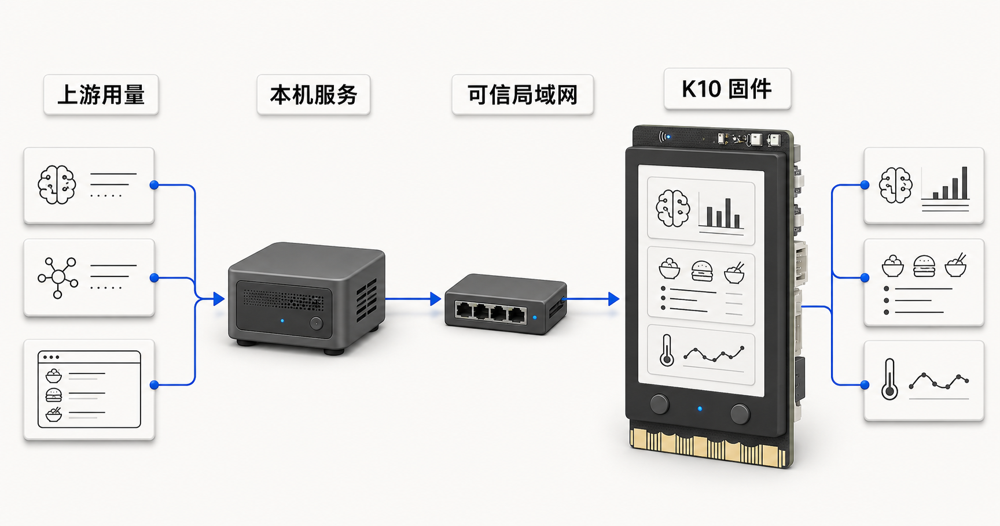

# 栖屏 DeskNest

> 栖于桌面，息于常亮之间。

[English](README.en.md) · 当前阶段：**V1.0 / Release Candidate**

DeskNest 是运行在 DFRobot 行空板 K10（UNIHIKER K10，ESP32-S3）上的桌面信息助手。它把 AI 用量、环境状态、每日饮食选择和设备设置集中到一块 240×320 小屏上；翻面时进入栖息状态，翻回后恢复原页面。


## V1.0 能做什么

- **桌面总览**：组合显示 AI 用量、下一次重置、温湿度、光照与生活信息。
- **AI 用量**：通过本机 [TokenNest](TokenNest/README.md) 聚合 ChatGPT/Codex 与 MiniMax 的 5 小时及 weekly 窗口。
- **what2eat**：在浏览器编辑候选菜品，显式发布到 K10；板端支持最多 15 项和 `B pick` 随机选择。
- **环境状态**：读取 K10 板载 AHT20、LTR303 与 SC7A20H，并在总览中给出桌面舒适度提示。
- **板端设置**：可调整首页焦点、AI 提醒阈值与省电模式，设置保存在 NVS。
- **翻面栖息**：正面朝下时关闭常规交互，翻回后恢复先前页面和缓存数据。

V1.0 使用固定竖屏方向。运行时横竖屏切换不属于本版本。

## 系统组成

```text
ChatGPT / MiniMax
        │
        ▼
TokenNest（Windows 本机，HTTP :8787）
        │ 可信局域网
        ▼
DeskNest 固件（K10）
        │
        ├─ AI 用量与重置时间
        ├─ what2eat 发布内容与本地缓存
        ├─ 板载传感器
        └─ 按键 / 手势 / 翻面状态
```


生产 UI 只有一条路径：`src/ui_lvgl.cpp` 消费 `src/ui_model.*` 生成的 `UiModel`。业务状态、传感器、网络同步和页面跳转不在 renderer 内处理。参见 [当前架构](docs/ARCHITECTURE.md)。

## 准备环境

- DFRobot UNIHIKER K10；
- Windows PowerShell；
- PlatformIO；
- Node.js `>=18.17.0`，用于 TokenNest；
- 与本仓库同级的 CNFontNest checkout，或通过 `CNFONTNEST_ROOT` 指定其位置；
- `lv_font_conv 1.5.3`，CNFontNest 会在固件构建前验证版本。

推荐目录布局：

```text
C:\HinarCode\
├─ DeskNest\
└─ CNFontNest\
```

## 快速开始

### 1. 启动 TokenNest

```powershell
cd C:\path\to\DeskNest\TokenNest
npm install
Copy-Item config\minimax.example.json config\minimax.json
Copy-Item config\tokennest.example.yaml config\tokennest.yaml
Copy-Item .env.example .env
npm test
npm start
```

按 [TokenNest 说明](TokenNest/README.md) 配置 ChatGPT/Codex OAuth 与 MiniMax API key。启动后先检查：

```powershell
Invoke-RestMethod http://127.0.0.1:8787/healthz
```

K10 不能使用 `127.0.0.1` 访问电脑。板端 URL 必须使用电脑的局域网 IPv4，例如 `http://192.168.1.20:8787/status.json`。

### 2. 写入本机配置

首次构建会从 `platformio.local.ini.example` 创建被 Git 忽略的 `platformio.local.ini`。也可以手动复制：

```powershell
Copy-Item platformio.local.ini.example platformio.local.ini
```

编辑其中的 `[secrets]`：

```ini
[secrets]
wifi_ssid     = YOUR_WIFI_SSID
wifi_pass     = YOUR_WIFI_PASSWORD
tokennest_url = http://YOUR_LAN_IP:8787/status.json
```

不要提交 `platformio.local.ini`、`TokenNest/.env`、真实 API key 或生成的 `include/generated/secrets.h`。

### 3. 编译、烧录与串口监视

本项目的 PlatformIO 环境名是 `DeskNest`，源码根目录由 `src_dir = .` 指向仓库根目录。

```powershell
cd C:\path\to\DeskNest
C:\Users\DF\.platformio\penv\Scripts\pio.exe run -e DeskNest
C:\Users\DF\.platformio\penv\Scripts\pio.exe run -e DeskNest -t upload
C:\Users\DF\.platformio\penv\Scripts\pio.exe device monitor -b 115200
```

当前 V1.0 的受支持发布路径是 PlatformIO。`DeskNest.ino` 只是转发到真实应用入口的薄包装；Arduino IDE 和 Mind+ 不作为本版本的构建验收路径。

## 基本操作

V1.0 默认使用手势优先模式：

| 操作 | 默认行为 |
| --- | --- |
| 短按 A | 开关“手势需要按住 A 确认” |
| 长按 B 约 1 秒 | 返回桌面总览 |
| what2eat 页短按 B | `B pick`，重新选择一项 |
| 设置页短按 A | 选择下一行 |
| 设置页短按 B | 切换当前行的值并保存 |
| 翻到正面朝下 | 进入栖息状态 |
| 从背面翻回 | 唤醒并恢复翻面前页面 |

设置项和完整页面说明见 [V1.0 用户手册](docs/USER_GUIDE.md)。

## 验证

```powershell
# 固件侧 host 测试
C:\Users\DF\.platformio\penv\Scripts\pio.exe test -e desknest_test

# 固件编译
C:\Users\DF\.platformio\penv\Scripts\pio.exe run -e DeskNest

# TokenNest
cd TokenNest
npm test
```


## 文档

- [V1.0 用户手册](docs/USER_GUIDE.md)
- [当前架构](docs/ARCHITECTURE.md)
- [TokenNest 使用说明](TokenNest/README.md)
- [TokenNest 启动与自启](TokenNest/docs/STARTUP.md)
- [TokenNest ↔ K10 协议](TokenNest/docs/WIRE_FORMAT.md)

## English summary

DeskNest V1.0 is a portrait-first desktop assistant for the UNIHIKER K10. It displays AI usage, local environment data, a browser-managed what2eat list, persistent device settings, and a face-down rest state. The supported build path is PlatformIO, while TokenNest runs locally on Node.js and serves the board over a trusted LAN. See [README.en.md](README.en.md) for the English quick start.
