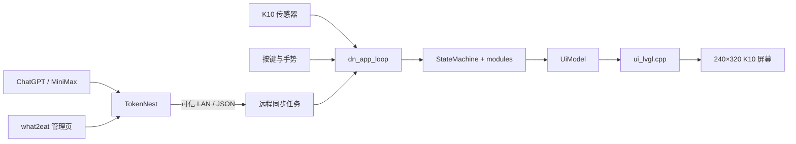

# DeskNest V1.0 当前架构

> Current architecture summary. 本文描述 V1.0 已落地结构，不是未来重构提案。

## 1. 运行路径



固件入口为 `DeskNest.ino`，它只把 Arduino 的 `setup()` / `loop()` 转发给 `dn_app_setup()` / `dn_app_loop()`。`platformio.ini` 使用 `src_dir = .`，因此仓库根目录是构建根，而不是只有 `src/`。

## 2. 分层职责

| 层 | 主要文件 | 职责 |
| --- | --- | --- |
| 应用编排 | `src/app.cpp` | 初始化、轮询顺序、远程任务与背光边界 |
| 输入 | `src/buttons.*`, `src/gesture.*` | K10 按键、加速度手势、翻面检测与重武装 |
| 状态 | `src/state_machine.*` | 页面、系统状态、设置选择、电源超时和恢复规则 |
| 业务模块 | `src/ai_usage_module.*`, `src/what2eat_*`, `src/environment_module.h`, `src/device_settings.*` | 网络解析、缓存、环境计算、设置持久化 |
| 页面注册 | `src/page_registry.h` | 竖屏页面顺序、标题和分组 |
| 渲染模型 | `src/ui_model.*` | 把状态、模块快照和展示文案转换成 `UiModel` |
| 生产 UI | `src/ui_lvgl.cpp` | 唯一生产 renderer；仅消费模型并维护 LVGL 对象 |
| 本机服务 | `TokenNest/src/` | 聚合上游用量，管理 what2eat 草稿/发布/ACK |

`src/ui.cpp` 是退休的 Canvas 占位文件，不是备用生产路径。

## 3. 固件数据流

每轮主循环的边界是：

```text
sensors → gesture → buttons → state machine → module snapshots → UiModel → LVGL
```

UI 不决定页面跳转，不访问网络，不持有业务真值。`src/ui_model.cpp` 可以从运行时单例采集输入，但页面 renderer 只能读取构建完成的 `UiModel`。

## 4. TokenNest 边界

TokenNest 提供两组能力：

- AI 用量：`/status.json` 是 K10 协议，`/api/usage` 是扩展诊断视图，`/healthz` 表示上游健康度；
- what2eat：草稿、显式发布、revision 拉取、双槽板端缓存和 ACK。

K10 使用电脑的局域网 IP 访问 TokenNest。服务监听可信本地网络，不具备公网级 TLS、设备身份和零信任授权。

板端设置由 K10 NVS 所有；TokenNest 的 `/api/desknest` 不是 V1.0 板端设置的权威源。

## 5. 持久化

- `DeviceSettings` 使用 schema version 1 保存首页焦点、AI 提醒和省电模式；
- what2eat 使用版本化快照、双槽 Preferences 缓存和 ACK revision；
- WiFi、TokenNest URL 与 API 凭证只存在于被忽略的本机配置或生成文件中。

## 6. 字体构建

PlatformIO 的 `DeskNest` 环境在编译前运行 `scripts/cnfontnest_pio.py`。它调用独立 CNFontNest，根据 `tools/cnfontnest.json` 生成并验证 LVGL 字体。正式配置固定 `lv_font_conv 1.5.3`；manifest 保存在被忽略的 `.cnfontnest/`，生成的字体 C 文件由 DeskNest 仓库持有。

what2eat 使用单独的 1bpp 动态字体配置以覆盖较大范围的 CJK 文本，但这仍不是任意 Unicode fallback。

## 7. 验证层级

| 层级 | 能证明什么 | 不能证明什么 |
| --- | --- | --- |
| 静态检查 | 链接、schema、边界、diff 和敏感信息排除 | 程序能够运行 |
| Host 测试 | 纯逻辑、解析、状态机和回归行为 | K10 BSP、屏幕和真实传感器 |
| 固件构建 | Xtensa 工具链能够生成固件 | 屏幕排版、输入手感和联网 |
| TokenNest 测试/运行 | Node 路由、持久化和本机 HTTP | K10 NVS 与物理交互 |
| K10 实机 | 启动、显示、按键、手势、缓存和背光 | 尚未观察的场景 |

## 8. 决策边界

- V1.0 固定竖屏，运行时旋转事件不改变页面；
- K10 行为优先于 PC simulator；
- `UiModel` 是 UI 数据边界；
- `src/ui_lvgl.cpp` 是唯一生产 renderer；
- TokenNest 只面向可信 LAN；
- 动态网络文本必须经过长度、字符和 schema 校验。

## English summary

DeskNest V1.0 uses a single LVGL renderer fed by `UiModel`. The app loop collects sensors, gestures, buttons, remote snapshots, and state-machine output before rendering. TokenNest runs on the PC and serves AI usage plus versioned what2eat data over a trusted LAN. Device settings remain board-owned in NVS. Runtime orientation switching, public-internet TokenNest hosting, and simulator-based release acceptance are outside V1.0.
